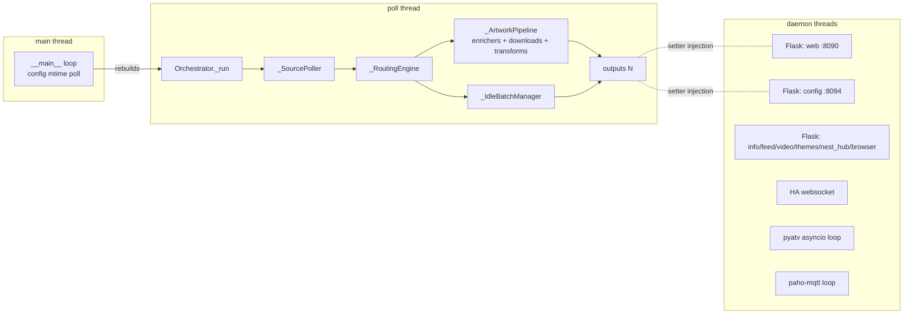
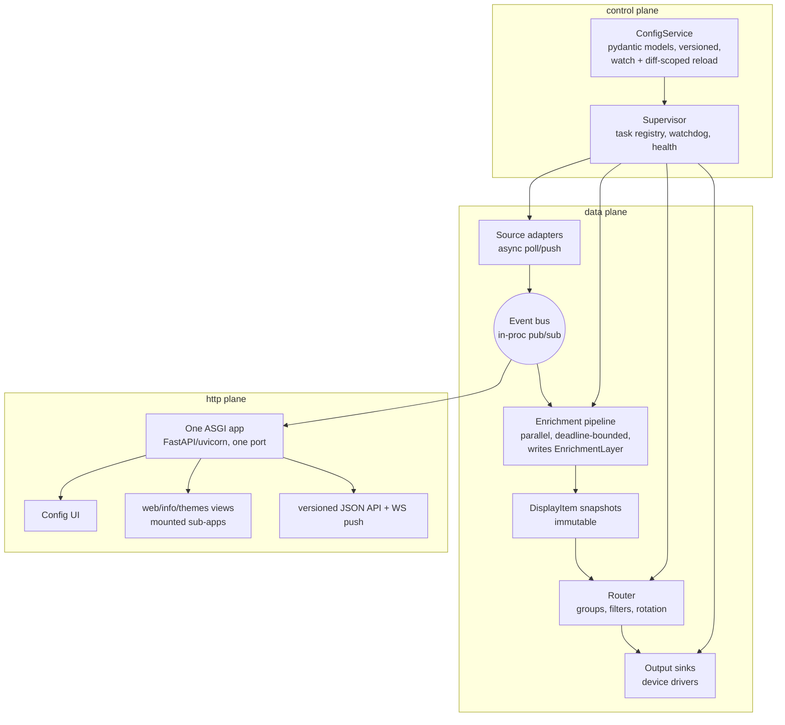

# media-display — Comprehensive Architecture & Usability Review

*Reviewed: July 2026, branch `gui-redesign` (HEAD `180f402`). Reviewer role: Principal
Software Architect / Senior UX Engineer / Technical Product Lead. Scope: architecture and
usability, not code style or individual bugs.*

---

## Phase 1 – Understanding the Project

### What it does

`media-display` (package `mediainfo`) is a single-process Python application for a home
network. It polls "now playing" state from media players (Kodi, Plex, Jellyfin/Emby, Sonos,
Spotify, Apple TV, Chromecast, MPD, LMS, Home Assistant, a vinyl recognizer, and more —
18 source plugins), enriches that state with artwork and metadata from external services
(TMDb, fanart.tv, MusicBrainz, Discogs, Last.fm, Wikipedia, the *arr suite — 16 artwork
enrichers plus 3 text enrichers), and pushes the result to displays and integrations
(Pixoo64 LED matrix, Ulanzi clock, Nest Hub, web pages, a themed display SPA, MQTT/Home
Assistant, RSS/Atom feeds, a folder of image files — 11 output plugins). When nothing is
playing, idle wallpaper sources (Unsplash, Pexels, local folders, art museums, Last.fm
history) take over.

### Apparent goals

- Turn any screen in the house into a reliable, always-on "what's playing" display.
- Make configuration approachable for a non-technical household member (guided config UI,
  first-run wizard, no-YAML-required starter config).
- Be a hobbyist-friendly, extensible plugin platform (documented "Extending" section,
  registry-driven plugin families).

### Intended users

Two distinct personas, and the codebase visibly serves both:

1. **The operator/developer** (you): installs via Docker, edits YAML, adds plugins.
2. **The household user**: looks at displays; occasionally opens the config UI to toggle a
   source or press "Hitster-safe mode".

### Primary workflows

1. Startup → poll loop → route → enrich → display (the permanent background workflow).
2. First run: `setup.sh` → starter config → config UI wizard → add sources/displays.
3. Ongoing config: config UI (guided form or raw YAML) → validate → backup → save →
   hot-reload (or restart for `outputs`/`auth`).
4. Operations: `/health`, alerting, log files, Docker healthcheck, config backups/restore.

### Technical constraints (stated or implied)

- Single machine, trusted LAN, Python ≥ 3.10, no external database (SQLite + files).
- No build step for the web UIs (hand-written HTML/JS/CSS, Jinja).
- Tests must never touch the network or real devices.
- Config file is the single source of truth; must stay hand-editable and comment-preserving.

### Strengths (summary — details in later phases)

- **Exceptionally disciplined plugin taxonomy**: five plugin families, each with a base
  class, a config dataclass, a registry entry, and registry-parity tests.
- **Rationale-dense documentation culture**: nearly every module/method documents *why*,
  not *what*. Onboarding a new developer here is far easier than in most hobby projects.
- **Error isolation as an enforced invariant**: `_safe_call`/`_call_output`, per-source
  backoff, "one broken plugin never kills the loop" is real, not aspirational.
- **Config safety net**: validate-before-write everywhere, automatic backups, secret
  masking, env-var expansion, `pydantic.dataclasses` with `extra="forbid"`.
- **A serious test suite**: 110 test files, mocked network, regression tests for past bugs,
  registry-completeness tests, CI gates (ruff + mypy + pytest).
- **Honest operational affordances**: `/health`, alert manager, `validate-config`,
  `set-password`, `restore-backup` escape hatches for lockout scenarios.

### Weaknesses (summary)

- One synchronous poll thread does *everything*: polling, enrichment (N sequential HTTP
  calls), artwork download, image transformation, and output pushes.
- Eight separate Flask **development servers** on eight ports, all daemon threads.
- Cross-cutting wiring is a growing pile of `isinstance`-dispatched setter injections.
- Plugin registration is spread across 4–6 places that must be kept in sync by convention
  and tests.
- The config UI (which can rewrite `config.yaml` including credentials, and restart the
  process) has **no CSRF protection**, and LAN-origin requests bypass auth entirely.
- `NowPlaying` is becoming a god-model, mutated in place and shared across threads.
- Production internals are frozen in place by tests that patch private names
  (self-described in code: "kept so tests' patch(...) still resolves").

### Assumptions made by the original design

- One household, one process, one machine; ~1–20 outputs, ~1–20 sources.
- The LAN is fully trusted (auth exempts all RFC1918 addresses by design).
- Poll latency of a few seconds is acceptable; sub-second display updates are not a goal.
- Outputs are cheap to keep alive forever and cheap to restart the whole process for.
- YAML config will remain the single config surface; no per-user settings.

These are reasonable today. The review below focuses on which of them will crack first as
the project grows.

---

## Phase 2 – Architecture Review

### Current shape



### 2.1 Separation of concerns, modularity, cohesion — **good, with caveats**

The 2024/25 modularization roadmap clearly worked: `orchestrator.py` (390 lines) is now a
thin lifecycle owner delegating to five single-purpose collaborators
(`orchestrator_polling/routing/artwork/idle/health/state`). Plugin families are cleanly
separated with well-chosen base classes (`MediaSource`, `Output`, `ArtworkEnricher`,
`TextEnricher`, `IdleWallpaperSource`, themes). Cohesion within modules is high.

**Caveat 1 — test-frozen internals.** `orchestrator.py` keeps `_current` property aliases,
`_poll_sources`, `_classify`, `_resolve_now_playing`, and even an unused `import random`
purely so tests that patch/reach into private names keep passing (documented at
`orchestrator.py:15` and `:162-189`). This is test-induced design damage: the tests own the
internals now, and every future refactor pays the tax. *Consequence:* refactors get slower
and riskier over time; the "compat shim" layer grows.
*Options:* (a) live with it; (b) migrate tests to the collaborator seams
(`_SourcePoller.poll`, `_RoutingEngine.tick`) and public behavior, then delete the shims;
(c) introduce an explicit test-fixture API.
*Recommendation:* (b), incrementally — every time a test file is touched for another
reason, move it off the shims; delete shims when the last patcher is gone.
Effort: M (spread over months). Long-term benefit: high.

**Caveat 2 — the poll thread is the whole data plane** (see 2.4/Phase 6).

### 2.2 Dependency structure & wiring — **the weakest structural point**

`wiring.py` + `__main__._start_and_wire` implement dependency injection by hand: build
everything, then run seven `wire_*` functions, each doing
`for output in outputs: if isinstance(output, SomeOutput): output.set_something(...)`.

Why it's a problem:

- **O(features × output types) growth.** Every cross-cutting capability (health provider,
  history, hitster-safe, artwork refresh, rotate-now, media-data store, overrides) adds a
  `wire_*` function, a setter, an `Optional[...]` attribute that outputs must
  null-check forever, and an import in `__main__`. Seven already exist; the pattern invites
  an eighth.
- **Temporal coupling.** Outputs are constructed *before* the orchestrator exists, so every
  wired dependency must be optional-and-mutable. A missed `wire_*` call fails silently
  (feature just doesn't work).
- **`isinstance` dispatch defeats the plugin abstraction.** `wiring.py` imports concrete
  output classes (`WebOutput`, `MqttOutput`, `ConfigUiOutput`, `ThemesOutput`), so the
  "core doesn't know plugins" boundary is already breached.

Solutions considered:

1. **App context object**: build one `AppServices` dataclass (health provider, history,
   hitster-safe handle, command bus, media-data store, overrides) and pass it to every
   output at construction (or via one `output.attach(services)` call). Outputs pull what
   they need; core stops knowing output types.
2. **In-process event/command bus**: outputs subscribe to topics ("health", "history") and
   publish commands ("refresh_artwork", "rotate_now"); the orchestrator subscribes to
   commands. Fully decouples, at the cost of indirection.
3. Keep the pattern but consolidate all `wire_*` into one function.

*Recommendation:* Option 1 now (S/M effort, mostly mechanical, kills all seven functions
and the isinstance checks), with option 2's command half only for the orchestrator control
flags (`request_artwork_refresh`, `request_rotation_now`, hitster-safe), which are already
a de-facto command bus of `threading.Event`s. Long-term benefit: high — this is the main
extensibility bottleneck for new cross-cutting features.

### 2.3 Plugin architecture & registries — **good idea, too many sync points**

Adding one output today touches, at minimum: `registries.OUTPUT_CLASSES`,
`config/outputs.py` (dataclass), `OUTPUT_CONFIG_TYPES`, possibly `OUTPUT_EXTRA_ARGS`,
`OUTPUT_DETAIL_FIELDS`, `config.example.yaml`, README — and for enrichers also the
`*_AWARE_ENRICHER_NAMES` string sets that drive constructor-argument injection. The code
knows this is a liability: `Output.name`, `Output.config_class`, and `capabilities` were
added as "self-declaration" hooks but **nothing consumes them yet** (`outputs/base.py:19-30`).

Why it matters: registry/config drift is only caught by dedicated parity tests; the
`LIBRARY_AWARE`/`CACHE_AWARE`/`MEDIADATA_AWARE` name-sets are an ad-hoc, string-keyed DI
system that will not scale past the third dependency kind (it's already at three).

Solutions:

1. **Finish the self-declaration migration**: make each plugin class declare
   `name`, `config_class`, and `requires = {"library", "cache_dir", "mediadata"}`; build
   the registries *from* the classes (one import-light manifest per family, or keep dotted
   paths but validate against class attributes at test time). Constructor injection then
   reads `requires` instead of name-sets.
2. Python entry-points (`importlib.metadata`) for true third-party plugins.

*Recommendation:* (1) now — the hooks already exist, so this is finishing a started
migration (M effort, high benefit). (2) only if external plugin authors materialize
(see Phase 11). The lazy dotted-path resolution in `registries.py` is genuinely good and
should be kept.

### 2.4 Concurrency, threading, async — **ad hoc and at its limit**

Inventory: 1 orchestrator thread, 1 main/config-watch thread, 8 Flask dev-server daemon
threads (`app.run(...)` at `web.py:337`, `config_ui.py:250`, `themes.py:342`, `info.py:105`,
`feeds.py:130`, `video.py:126`, `nest_hub.py:117`, `browser.py:63`), plus per-plugin
threads (HA websocket, pyatv asyncio loop, MQTT network loop, themes auto-rotate, web
client-rotate, video refresh, media-data-store background refresh, Apple TV pairing loop).

Problems, in order of severity:

1. **Everything user-visible happens serially on one thread.** A tick does: poll each
   source (HTTP, ≤5s timeout each) → run *every* enricher sequentially (each 1–4 HTTP
   calls) → download artwork (10s timeout each, with fall-through retries across the whole
   image pool) → PIL transforms / LED prep / OpenCV text removal → push to each output
   (Pixoo HTTP, MQTT publish...). Worst-case tick is tens of seconds; `poll_interval_seconds`
   is 5. One slow enricher (e.g. Wikipedia on a cold cache) delays *every* display, and
   rotation timing for all groups jitters with it.
2. **Daemon threads = no graceful HTTP shutdown.** `stop()` on Flask outputs can't actually
   stop `app.run()`; shutdown relies on the process dying. Fine today; it blocks the
   hot-reload-outputs goal (`Output.reload` is declared but uncallable in practice while
   servers can't be stopped).
3. **Cross-thread mutable state with informal locking.** Route-group state is
   single-thread-by-convention (documented), hitster-safe has a lock, but `group.current`
   (a `NowPlaying`) is handed to Flask threads via `on_new_item` and then *mutated in
   place* every tick (`_refresh_position`, `orchestrator_routing.py:93`). Benign for
   floats today; a data race by construction, and a trap for the next field.

Solutions:

1. **Full asyncio rewrite.** Cleanest end state, XL effort, huge regression surface for a
   working app. Not recommended as a step.
2. **Pipeline decomposition with threads** (keep sync code): poll loop only *routes*;
   enrichment jobs run on a small `ThreadPoolExecutor` with a per-enricher deadline;
   artwork prefetch happens when an item is enriched, not when an output shows it; outputs
   are pushed from the routing thread using already-local files.
3. Minimal: add per-enricher wall-clock budget + parallelize only enrichers.

*Recommendation:* (2), staged — start with (3) (S effort, immediately fixes the worst
latency: enrichers are independent by contract, `_safe_call` already isolates failures).
Deliver immutable snapshots to outputs (copy `NowPlaying` or freeze it) as part of the same
work. Long-term benefit: high — this is the biggest reliability/perf lever in the codebase.

### 2.5 Domain model — **pragmatic, starting to smell**

`NowPlaying` (`models.py`) has grown 20+ fields; each new enricher adds another
(`cast`, `discography`, `ai_text`, `synced_lyrics`, `studio`, `rating`...). Every field is
mutable, populated by in-place mutation during `enrich_item`, and the same instance is
shared across route groups (donor pattern in `_ArtworkPipeline.prepare_item`) and across
threads (web/themes outputs render it).

Consequences: (a) unclear ownership — which enricher wrote `summary`? last-writer-wins with
enricher ordering as an invisible contract; (b) `identity` is `(source, title, subtitle)` —
a track with identical title/subtitle from the same source but a different album is "the
same item" (mostly fine, occasionally wrong); (c) thread-safety as above.

*Options:* (i) leave it; (ii) split into `NowPlaying` (source facts, frozen) +
`Enrichment` (accumulated, keyed by enricher name where collisions are possible) with a
composed, immutable `DisplayItem` snapshot handed to outputs; (iii) full typed
per-media-type models (`MusicItem`/`MovieItem`/`EpisodeItem`).
*Recommendation:* (ii). (iii) sounds cleaner but every output would grow type dispatch;
the flat model is genuinely convenient for display code. Effort: M. Benefit: medium-high
(unlocks safe parallel enrichment too — enrichers writing to their own namespace can't
race).

### 2.6 Configuration management — **strong**

Pydantic dataclasses with `extra="forbid"`, env-var expansion with defaults, validate
before every write, comment-preserving `ruamel.yaml` saves, automatic backups, a
`validate-config` CLI, and hot-reload with keep-last-good-on-failure
(`__main__.py:114-118`). This is better than most commercial products. Gaps are covered in
Phase 5 (error message quality, no schema versioning, restart asymmetry).

### 2.7 Error handling & logging — **very good**

Consistent catch-log-degrade at every plugin boundary; `RotatingFileHandler`; alerting on
sustained failure. Two improvements worth making: (a) `logger.exception` on every poll
failure of an offline device produces noisy repeated tracebacks — the backoff system knows
a source is down; log the first failure at ERROR with traceback and subsequent ones at
DEBUG one-liners. (b) There's no correlation between "what changed" logs and per-output
push logs — a per-tick sequence id in log records would make multi-output debugging much
easier. Both S effort.

### 2.8 API design — mostly internal; the `/health` payload doubles as the UI's data API and
is versionless. Fine now; if HA/MQTT consumers or the dashboard SPA grow, freeze a
versioned schema (S effort, do it when the new dashboard stabilizes).

---

## Phase 3 – Codebase Organization

Current layout is logical and discoverable (sources/, enrichers/, outputs/, idle/, themes/,
config/, plus ~30 top-level modules). Naming is consistent (`FooSource`, `FooEnricher`,
`FooConfig`). Specific issues:

| Issue | Detail | Recommendation |
|---|---|---|
| `outputs/` mixes two apps | The config UI backend (config_ui, config_schema, config_store, config_dashboard, ui_builder, ui_model, config_yaml_io, appletv_pairing ≈ 3,300 lines) lives inside `outputs/` because it happens to be delivered as an Output plugin | Move to `mediainfo/configui/` package; keep a thin `ConfigUiOutput` adapter in `outputs/`. S/M effort, high clarity win |
| Top-level module sprawl | 30+ flat modules (`colors`, `led_image`, `text_removal`, `lyrics_wordcloud`, `transforms`…) | Group: `mediainfo/imaging/` (led_image, text_removal, transforms, colors, lyrics_wordcloud), `mediainfo/stores/` (media_data_store, poster_store, text_cache, artwork_overrides, history, musiclibrary). S effort, cosmetic but compounding |
| Cross-module private imports | `health.py` imports `_is_secret` from `outputs.config_schema`; config_store imports 10 underscore names from config_schema | Promote shared names to public (drop `_`) or move to a shared module. Secret-field detection is security-relevant and deserves a public home (`mediainfo/secrets.py`). S effort |
| `__main__.py` is 652 lines | Entry point + 6 subcommands + lifecycle loop | Split subcommands into `mediainfo/cli/`. S effort |
| Underscore-named collaborators (`_ArtworkPipeline`, `_RoutingEngine`) imported across modules | They're de-facto public within the package | Drop the underscores; they mislead. Trivial |
| 105 KB `app.html` single template | Inline JS/CSS, no build step (deliberate) | Fine as a constraint, but split into Jinja includes per section — no build step needed for that. M effort |

Duplication is impressively low for a codebase this size (the `arr_base`, `adb_base`,
`jsonrpc`, `text_base` shared bases show active de-duplication). One real duplicate:
`ImageCache.get_path` vs `download_temp` share ~80% (fetch/validate/normalize) — extract
the common core (S).

---

## Phase 4 – User Experience Review

Evaluated as a first-time, non-technical user.

### What's genuinely good

- `setup.sh` → starter config → "open http://…:8094" is a real no-YAML path, and the
  first-run wizard (Fas 11) addresses the empty-config cliff.
- The guided form is generated from config dataclasses with friendly labels/help — new
  plugins get UI for free.
- Secrets are handled correctly in the UI (never echoed, "Configured/Replace" pattern).
- Test-connection buttons, health cards, and plain-language status pills (no emoji, per
  design decision) give real feedback.
- Config backups + restore give confidence to experiment.

### What will confuse a non-technical user

1. **The port zoo.** Web on 8090, feeds on 8086, info on 8093, config on 8094, themes,
   video, nest_hub each on their own port. A household user cannot remember which port does
   what, and bookmarks multiply. This is the single biggest UX defect, and it's
   architectural (one Flask app per output). → See Phase 11: unify HTTP outputs behind one
   server/port with paths (`/`, `/config`, `/info`, `/feed`…). Until then: make the config
   UI's home page a launchpad that links to every enabled HTTP output by discovered URL
   (S effort, big relief).
2. **Two shells mid-migration.** "/" is the new dashboard SPA; most sections link back into
   the classic shell (`/form`); `ui: dashboard` config flag flips behavior; library and
   overrides are separate full pages. Users can't build a mental map while the IA is split
   across two generations. → Finish the phased migration before adding features; keep exactly
   one nav.
3. **Restart semantics leak everywhere.** "Most settings hot-reload, except outputs and
   auth, and the restart button only works under a supervisor, otherwise the process just
   exits" (`config_ui.py:102-111`) is a lot of state for a user to hold. The
   `restart_required` flag is deliberately coarse (any outputs/auth save sets it). →
   Short-term: keep the banner but diff old/new config so no-op saves don't nag (S). Long
   term: make outputs hot-reloadable (Phase 12, High Value) and delete the concept.
4. **Error messages surface pydantic internals.** A typo'd *section* gets a friendly
   "Unknown output plugin 'pixxoo' — ignored. Check for typos." A typo'd *field inside* a
   section, or a wrong type, raises a pydantic `ValidationError` string. In the UI's raw
   editor that means developer-speak. → Wrap validation errors in a translator
   ("`pixoo` doesn't have a setting called `briteness` — did you mean `brightness`?").
   S/M effort, high perceived quality.
5. **Terminology drift.** "Sources / outputs / enrichers / idle sources" (code, YAML,
   README) vs "Media / Displays / Metadata / Idle screen" (new IA). The YAML keys can't
   change, but every UI surface should use exactly the new human vocabulary, including
   health payload labels shown in the dashboard.
6. **Accessibility** was not evaluable in depth from code, but the hand-written SPA has no
   evident focus management or `aria-live` for async status updates (test results, pairing
   wizard). Worth an audit once the new shell stabilizes (M).
7. **README as a wall.** 54 KB single README. First-time users need a 1-page quickstart;
   everything else belongs in `docs/` (config reference could even be generated from the
   dataclasses + help text, which already exist as structured data). M effort.

---

## Phase 5 – Configuration Review

| Aspect | State | Assessment |
|---|---|---|
| Files | One YAML, example + starter variants | Good. `config.example.yaml` (59 KB) doubles as reference doc — generate it from dataclasses eventually to prevent drift |
| Validation | pydantic `extra="forbid"` + `validate_config()` warnings + validate-before-save | Strong. Improve error *wording* (Phase 4.4) |
| Defaults | Safe defaults throughout; new integrations disabled by default | Excellent |
| Live updates | mtime poll every 2 s; rebuilds orchestrator; keeps last-good on parse failure | Good. Note: reload rebuilds `ImageCache`/enrichers even when only e.g. `alerts` changed — harmless but means idle batches restart; a section-level diff could skip rebuilds (Nice to Have) |
| Import/export | None explicit (file copy works; backups exist) | Add "download config / upload config" to the UI — trivially built on existing store (S) |
| Profiles | None | Not needed for the domain; skip |
| Version migration | **None.** No `config_version` key; renames rely on `extra="forbid"` *rejecting* old keys | This is the real gap: today a renamed field turns a working install into a failing one with a pydantic error. Add `config_version: 1` + a tiny ordered-migrations list now, while all configs are trivially "v1" (S effort, prevents an XL headache) |
| Backup/restore | Automatic pre-save backups, CLI + UI restore, restore-is-backed-up-too | Excellent — genuinely best-in-class for a hobby project |
| Secrets | Env-var interpolation, masking list, UI never round-trips secrets | Strong. But secrets at rest are plaintext YAML and auth compares them directly — see Phase 8 |

---

## Phase 6 – Performance Review

For its intended scale, the app is fine day-to-day; issues are tail latency and unbounded
growth.

| # | Finding | Impact | Fix |
|---|---|---|---|
| 1 | Sequential enrichment on the tick thread: every enabled enricher runs on each track change, each with network I/O; then artwork downloads happen per-output-push with fall-through retry over the whole pool | Track change → display latency of seconds to tens of seconds worst case; all outputs and rotation stall together | Parallelize enrichers (bounded executor + deadline); prefetch artwork at enrich time (M — the #1 perf fix) |
| 2 | `music/` cache tier is *never purged by design* (`cache.py:303-311`) and `mediadata/` grows per artist/album forever | Unbounded disk growth on small devices (Pi) — the likeliest way this app dies after two years | Add a size-capped LRU sweep (respect max total MB, evict by atime) even for music (S) |
| 3 | Heavy image work on the tick thread: OpenCV text detection, LED prep, transforms — disk-cached after first build (good), but first-build cost lands on the shared thread | Occasional multi-second freezes of all outputs on new artwork | Falls out of fix #1 (do output-specific derivation in the prefetch stage) |
| 4 | 8 Flask dev servers, each polling/blocking independently; web output additionally runs a per-client rotate loop | Memory footprint (~8 Flask apps), thread bloat; dev server is single-process | Consolidate HTTP (Phase 11) |
| 5 | Config mtime poll (2 s) + schedule tick getattr per output per tick | Negligible | Leave |
| 6 | `ImageCache` re-downloads when a URL changes even if content identical (hash of URL, not content) | Minor duplicate storage (e.g. Kodi vs TMDb same poster) | Not worth fixing |
| 7 | Startup: lazy registry resolution avoids importing unused plugin deps — already optimized | — | Keep |

---

## Phase 7 – Reliability Review

Strong overall: failure isolation, exponential backoff per source, nothing-playing grace
period, retry-via-rotation for failed pushes (`_maybe_rotate` deliberately re-pushes
single-image items so a transiently-unreachable Pixoo recovers — `orchestrator_routing.py:214`),
last-good-config on reload failure, Docker healthcheck wired to a liveness (not readiness)
endpoint with a documented rationale.

Gaps:

1. **Restart is the only recovery for wedged plugin threads.** If the HA websocket thread,
   MQTT loop, or a Flask thread dies, nothing restarts it; health may or may not notice
   depending on the plugin. → Add a thread supervisor: plugins register their long-lived
   threads; a watchdog logs + optionally restarts dead ones and reports them in `/health`
   (M effort, high value for an always-on appliance).
2. **No global watchdog on the tick itself.** A hung HTTP call without a timeout somewhere
   (all reviewed calls do set timeouts — good) or a deadlock would silently freeze all
   displays while `/health/live` stays green. → Expose "seconds since last completed tick"
   in `/health` and alert on it (S — the data mostly exists in `_HealthTracker`).
3. **SQLite stores** (history, music library): no corruption handling reviewed; a corrupt
   DB on an unclean Pi shutdown should degrade to "feature disabled + warning", not crash
   loops. Verify with a test (S).
4. **Graceful shutdown** covers orchestrator/outputs, but daemon Flask threads are killed
   mid-request by process exit. Acceptable; fix arrives free with HTTP consolidation.

---

## Phase 8 – Security Review

Context: trusted-LAN design, documented honestly in SECURITY.md. Within that threat model,
most choices are defensible. Two findings break the model *from inside the browser*:

1. **CSRF on the config UI (Critical).** Auth exempts private/loopback addresses
   (`web_auth.py:74-77`), and Flask sees the *victim's* LAN address when their browser is
   induced to send a request. Any website a household member visits can fire
   `fetch("http://192.168.1.x:8094/api/config", {method:"POST", ...})` — cross-origin
   responses are unreadable, but state-changing requests still execute unless preflighted.
   The config UI can rewrite `config.yaml` (including MQTT/Plex/etc. credentials — write,
   not read) and restart the process. DNS-rebinding makes it worse (bypasses even
   response-read restrictions by shifting origin).
   → Mitigations, cheapest first: (a) require a custom header (e.g. `X-Requested-With`) on
   all mutating API routes and send it from the UI's JS — forces a CORS preflight that
   cross-origin pages fail (S, do immediately); (b) validate the `Host` header against an
   allowlist to kill DNS rebinding (S); (c) proper session + CSRF token when/if login
   lands (M).
2. **Auth quality (High, but only when auth is actually in use).** HTTP Basic over plain
   HTTP; password stored in plaintext YAML; compared with `==` (`web_auth.py:79` — timing
   side channel, minor in practice). The design doc says auth exists precisely for
   *untrusted* exposure — which is exactly when Basic-over-HTTP is inadequate.
   → Store a salted hash (config already masks the field; `set-password` becomes the write
   path), compare with `hmac.compare_digest`, and document "expose only behind a
   reverse-proxy with TLS" as the supported pattern (S/M).
3. **Path/input handling**: cache filenames are SHA-256 of URLs (traversal-safe);
   `MediaDataStore` builds human-readable directories from artist/title — sanitization
   exists but is security-relevant and should have adversarial tests ("../", NUL, 300-char
   titles from a malicious Kodi item) (S).
4. **SSRF-shaped behavior (Low/accepted)**: enrichers fetch URLs supplied by sources; a
   compromised source could point the app at internal endpoints. Within the LAN trust
   model this is accepted; note it in SECURITY.md.
5. **Dependency surface (Medium)**: heavyweight always-installed deps (OpenCV, matplotlib/
   wordcloud, pyatv, adb-shell) widen the supply-chain and CVE surface for users who use
   none of those features. The "flat requirements, no extras" convention is documented and
   deliberate — but consider extras (`pip install mediainfo[pixoo,appletv]`) once packaging
   matures. Pin-and-update via Dependabot/renovate either way (S).
6. **Docker**: non-root user, matching host UID — good.

---

## Phase 9 – Maintainability

- **Readability: excellent.** The rationale-comment culture is the project's biggest
  maintainability asset. Risk: several docstrings are essays that will silently rot —
  prefer linking to a `docs/adr/` (architecture decision records) for the long stories.
- **Complexity hotspots**: `media_data_store.py` (935 lines — cache policy + fetch
  orchestration + path layout + wordcloud in one class; split fetchers from store),
  `config_ui.py` (833 lines even after extraction), `ui_builder.py` (655), `app.html`
  (105 KB). All four are on the natural fault lines already identified in Phase 3.
- **Hidden coupling**: enricher *ordering* determines metadata precedence (list order from
  YAML section order — invisible contract); `*_AWARE_*` name sets (Phase 2.3); tests
  pinning internals (Phase 2.1); config-schema underscore imports (Phase 3).
- **Technical debt register** (things the code itself flags as unfinished): `Output.reload`
  never called; `capabilities` never consumed; `test_connection` dispatched by type name in
  `config_dashboard.py` instead of the base-class method; classic-vs-new UI shells. This
  self-awareness is good — but each item should have an owner/decision, or be deleted;
  speculative hooks that sit unconsumed for another year are pure carrying cost.
- **Onboarding**: a new developer can be productive in days. CLAUDE.md, CONTRIBUTING, the
  Extending section, and the parity tests all help.

Refactoring priorities: (1) wiring → services context, (2) plugin self-declaration,
(3) config-UI package extraction, (4) test de-pinning, (5) NowPlaying split.

---

## Phase 10 – Testability

- **Unit coverage: excellent** (110 files; every plugin has a test; regression tests for
  named past bugs; no-network enforced by convention).
- **Structural risk**: tests assert internal names (Phase 2.1). Symptom to watch: production
  code sprouting comments like "kept for tests".
- **Integration gap**: there is no test that boots the *real* `__main__` wiring (config →
  outputs → orchestrator → tick → fake output) with a realistic config. The `test_wiring`/
  `test_smoke` files come close; a true end-to-end "appliance boots, plays a fake track,
  every enabled output got an update, config hot-reload swaps a source" test would catch
  the class of bug unit tests structurally can't (wiring omissions — precisely the failure
  mode of the setter-injection pattern) (M, high value).
- **UI testing**: Playwright + Chromium are already installed (per project memory) but UI
  tests are not part of CI. The 105 KB of hand-written SPA JS is the least-tested code in
  the repo while being the most user-facing. Add a small smoke suite (loads, nav works,
  save round-trips a field, secret never appears in DOM) (M).
- **CI suitability**: everything mocks the network; lint gates are defined
  (ruff + mypy + pytest). Good.

---

## Phase 11 – Future Growth

Assume 2× complexity (more plugins, the GUI redesign completed, maybe multi-room logic).

**What holds**: plugin taxonomy, config system, cache/store layers, health model, the test
culture. These scale to 2× without redesign.

**What breaks, in order:**

1. **The single tick thread** — more sources × more enrichers × more outputs multiply into
   one serial loop. Fix now (Phase 2.4); it's also the prerequisite for any responsive
   "refresh now" UX.
2. **The port-per-output HTTP model** — already a UX problem at 1×; at 2× it's untenable
   and blocks TLS, auth, and reverse-proxy simplicity. Move to **one HTTP server** (a
   single Flask app with blueprints per output, or waitress/gunicorn in front) where each
   HTTP-flavored output contributes a blueprint instead of owning a server. This also
   fixes the dev-server-in-production and daemon-thread-shutdown issues in one move.
   Effort: L. This is the single highest-leverage architectural change available.
3. **Setter-injection wiring** — each new cross-cutting feature costs O(outputs). Fix is
   cheap now (Phase 2.2).
4. **Output restart-only lifecycle** — once outputs are blueprints (no owned servers),
   `stop()/start()/reload()` become implementable, and the restart-required UX (Phase 4.3)
   dissolves.

**What NOT to build now**: distributed/multi-process services, cloud deployment, a mobile
app, a database server, a message broker. The single-process appliance model is a feature —
the roadmap above strengthens it rather than replacing it. If remote viewing is ever
wanted, the answer is "reverse proxy + real auth", not re-architecture.

---

## Phase 12 – Prioritized Improvement Roadmap

### Critical (before further feature development)

| # | Problem | Why it matters | Solution | Effort | Arch impact | User impact |
|---|---|---|---|---|---|---|
| C1 | Config UI mutating routes are CSRF-able; LAN IPs bypass auth | Any visited website can rewrite config.yaml / restart the app via the user's browser | Custom-header requirement on mutating APIs + Host-header allowlist | S | Low | Invisible (protective) |
| C2 | All enrichment/downloads/pushes serial on one thread | One slow service stalls every display; worst-case tens of seconds per track change | Bounded parallel enrichment with deadlines; prefetch artwork at enrich time; immutable snapshots to outputs | M | Medium | Faster, steadier displays |

### High Value

| # | Problem | Why it matters | Solution | Effort | Arch impact | User impact |
|---|---|---|---|---|---|---|
| H1 | 8 Flask dev servers / 8 ports | Worst UX defect; blocks TLS/auth/shutdown/hot-reload | One HTTP server, outputs contribute blueprints; production WSGI server | L | High | One address for everything |
| H2 | Setter-injection wiring (7 `wire_*` fns, isinstance dispatch) | Growth bottleneck for cross-cutting features; silent-failure risk | `AppServices` context passed at construction; command handles for orchestrator controls | S/M | High | None directly |
| H3 | Plugin registration spread across 4–6 sync points | Friction + drift risk for the project's main extension activity | Finish self-declaration (`name`/`config_class`/`requires` consumed; registries derived/validated) | M | Medium | None directly |
| H4 | No config schema versioning | First future field rename bricks existing installs (`extra="forbid"`) | `config_version` + ordered migrations, added while everything is v1 | S | Medium | Silent-upgrade safety |
| H5 | Two-shell UI mid-migration | Users can't form a mental model; double maintenance | Finish the phased IA migration before new features; single nav | M/L | Low | Large |
| H6 | End-to-end boot test missing | Wiring omissions are the failure mode unit tests can't catch | One real-wiring smoke test (boot → fake track → outputs updated → hot-reload) | M | Low | Fewer "worked in tests" bugs |

### Medium Value

| # | Problem | Solution | Effort |
|---|---|---|---|
| M1 | Auth: plaintext password, `==` compare, Basic-over-HTTP | Hashed at rest, `compare_digest`, document TLS-proxy pattern | S/M |
| M2 | Unbounded music/mediadata disk growth | Size-capped eviction sweep | S |
| M3 | Validation errors surface pydantic-speak | Error translator with did-you-mean | S/M |
| M4 | Tests pin orchestrator internals | Migrate to collaborator seams opportunistically; delete shims | M (amortized) |
| M5 | `NowPlaying` god-model, mutated in place, shared across threads | Frozen source snapshot + enrichment layer + immutable display item | M |
| M6 | Config-UI backend inside `outputs/`; top-level module sprawl | `configui/`, `imaging/`, `stores/` packages | S/M |
| M7 | No thread supervisor; no tick-age alarm | Watchdog registry + `seconds_since_last_tick` in /health with alert | S/M |
| M8 | Offline devices spam ERROR tracebacks every backoff retry | First-failure ERROR, then DEBUG until recovery | S |

### Nice to Have

| # | Item | Effort |
|---|---|---|
| N1 | Generate config reference + example YAML from dataclasses/help-text | M |
| N2 | Config download/upload in UI | S |
| N3 | Optional dependency extras (`[pixoo]`, `[appletv]`, …) | M |
| N4 | Entry-point third-party plugin loading | M |
| N5 | Playwright smoke suite in CI | M |
| N6 | ADRs replacing the longest rationale-docstrings | S |
| N7 | Section-diff hot-reload (skip rebuilding unchanged subsystems) | M |
| N8 | Versioned /health / UI data API schema | S |

Sequencing note: C1 → H4 → C2 → H2 → H3 → H1 → H5. H1 (HTTP consolidation) deliberately
comes after H2/H3 because blueprints are easiest to introduce once services/registration
are cleaned up; H5 (finish the GUI IA) should ride on top of H1's single-server world so
the new nav is built once, with real URLs.

---

## Phase 13 – Architecture Vision (greenfield)

If starting today, targeting the same product ("appliance that turns screens into
now-playing displays"), I would keep more of this design than I'd change — the plugin
taxonomy, YAML config, and reliability posture are right. The differences:

### Overall architecture

A single async process with three planes:



### Key choices and why

- **asyncio + one ASGI server (FastAPI/uvicorn)** instead of threads + 8 Flask apps: one
  port, native WebSockets (the web/themes outputs already push over WS), structured
  shutdown via task cancellation, and pyatv/HA-websocket integrate natively instead of via
  bridge threads. CPU-bound image work (PIL/OpenCV) goes to a small process/thread pool.
- **Event bus (in-proc, typed topics)** as the only coupling between planes:
  `TrackChanged`, `ItemEnriched`, `OutputPushed`, `SourceHealthChanged`, plus a command
  topic (`RefreshArtwork`, `RotateNow`, `HitsterSafe`). The current design already wants
  this — the `threading.Event` request flags and seven `wire_*` functions are a bus drawn
  freehand.
- **Plugin model**: one decorator per plugin
  (`@plugin(kind="source", name="kodi", config=KodiConfig, requires={"cache"})`), discovered
  from the package plus `importlib.metadata` entry points for third parties. One
  declaration point; registries become derived data.
- **Domain model**: frozen `MediaIdentity` + `SourceFacts` from sources; `EnrichmentLayer`
  keyed by enricher; composed immutable `DisplayItem` for sinks. Identity includes album
  for music.
- **Configuration**: pydantic `BaseSettings`-style models (versioned, migrations built in),
  same YAML file, same comment-preserving writer, same backup discipline — this part of the
  current system survives nearly unchanged.
- **UI**: one SPA, still build-step-free if desired, served by the single app, driven by a
  versioned JSON API; the form-from-schema generation idea is kept (it's one of the best
  ideas in the current codebase).
- **Folder structure**:

```
mediainfo/
  core/        # models, events, bus, supervisor
  configsys/   # models, load/save/migrate/backup
  pipeline/    # poller, enrichment, router, rotation
  plugins/
    sources/  enrichers/  sinks/  idle/  themes/
  stores/      # imagecache, mediadata, history, library, overrides
  imaging/     # transforms, led, text_removal, wordcloud, colors
  http/        # asgi app, api, ui, views
  cli/
```

### Why this would be superior

Every axis the current architecture is weakest on — tail latency (serial tick), operational
surface (8 ports/dev servers), extensibility of cross-cutting features (setter wiring),
lifecycle (restart-only outputs) — is structural in the greenfield design rather than
patched. And crucially, the migration path from *here* to *there* is exactly the Phase 12
roadmap: C2 introduces the pipeline stages, H2 introduces the services/command seam, H1
consolidates HTTP, H3 collapses plugin declaration. The vision is the roadmap's endpoint,
not a rewrite.

---

## Closing assessment

This is an unusually healthy hobby-scale codebase: deliberate, well-tested, honest about
its own debts, with a documentation culture most professional teams don't achieve. Its
risks are concentrated, not diffuse — one thread doing all the work, one HTTP model chosen
per-output instead of per-app, one wiring pattern that grows linearly with features, and
one browser-facing security gap. All four are fixable incrementally, and the codebase's
test discipline is exactly what makes those fixes safe to attempt. Fix C1 this week; start
C2 and H2 before the GUI redesign adds more weight on top of them.
